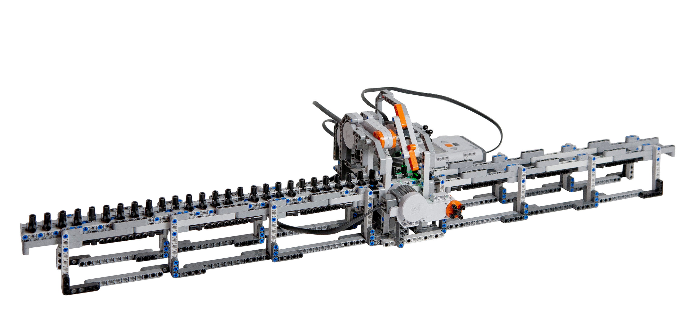
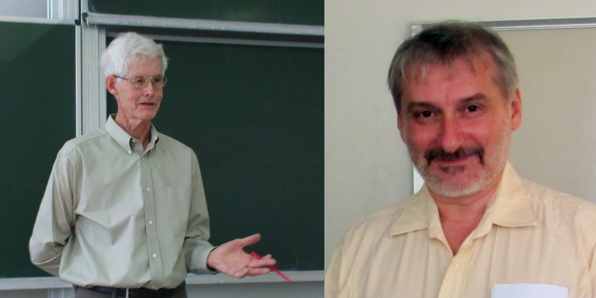
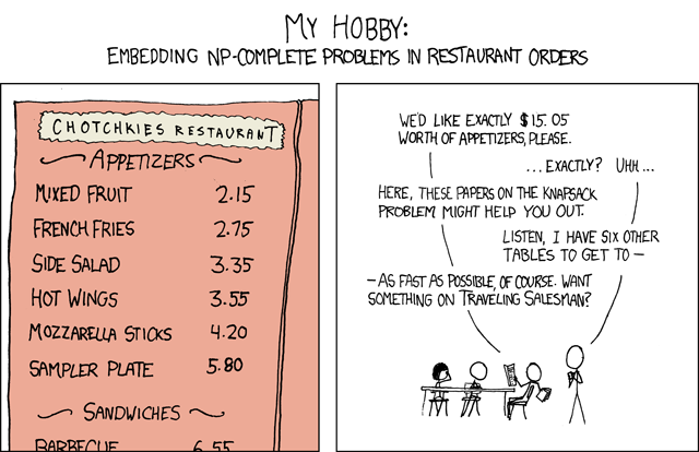
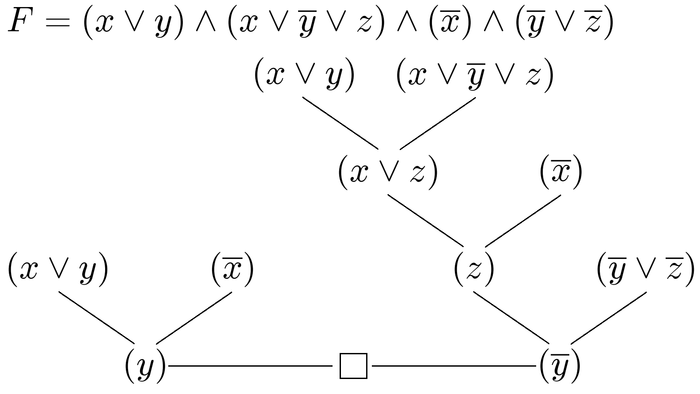

% Die P $\neq$ NP-Vermutung
% 6. Mai 2015
% Adrian Hein, Florian Weber

Einführung
==========

Turingmaschine
--------------

* mathematische Abstraktion eines Computers
* besteht aus
	* Steuerwerk
	* unendlich langes Steuerband
	* Lese- und Schreibkopf

Turingmaschine
--------------

* pro Schritt wird
	* ein Zeichen gelesen
	* ein Zeichen geschrieben
	* eine Bewegung ausgeführt
* jeder Schritt ist nur abhängig von
	* aktuellem Zeichen auf dem Band
	* aktuellem Zustand der TM
* eine TM hat endlich viele Zustände
* man kann Zustände als Endzustände definieren

Turingmaschine
--------------

Turingmaschine formal
---------------------

* formal besteht eine TM aus
	* $Q$, die endlichen Zustandsmenge
	* $\Sigma$, das endlichen Eingabealphabet
	* $\Gamma$, das endliche Bandalphabet und es gilt $\Sigma \subset \Gamma$
	* $\delta\colon (Q \setminus \{q_f\})\times \Gamma \to Q \times \Gamma \times \{L, 0, R\}$ ist die (partielle) Überführungsfunktion
	* $q_0 \in Q$ ist der Anfangszustand
	* $\square \in \Gamma\setminus\Sigma$ steht für das leere Feld
	* $q_{accept} \in Q$ ist der akzeptierende Zustand

Turingmaschine (nichtdeterministisch)
-------------------------------------

* ähnlich der deterministischen TM
* NDTM hat allerdings zwei Übergangsfunktionen $\delta_0$ und $\delta_1$
* endet eine Sequenz von Entscheidungen in $q_{accept}$ gilt die Eingabe als akzeptiert
* im Gegensatz zur deterministischen TM nicht ohne Weiteres realisierbar
	
Turingmaschine (mehrband)
-------------------------

* hat anstatt einem Band mehrere mit jeweils einem Lese- und Schreibkopf
* kann durch eine TM mit einem Band simuliert werden
* aus $k$ Bändern werden $2k$ Spuren auf dem einen Band der TM
	* Spur 1 enthält Band 1, Spur 2 die Position auf Band 1, Spur 3 enthält Band 2, ...
* alternativ werden aus $k$ Bändern $k + 1$ Spuren
	* auf den ersten $k$ Spuren stehen die $k$ Bänder
	* auf der Spur $k+1$ wird die Kopfposition markiert
	* bewegen sich die einzelenen Köpfe in unterschiedliche Richtungen werden die Symbole auf den entsprechenden Spuren verschoben
* mehrband TMs sind genauso mächtig wie normale TMs aber evt. anschaulicher

	
Die Klasse P
------------

* enthält alle Entscheidungsprobleme die in Polynomialzeit von einer TM lösbar sind
* Probleme in P gelten als praktisch lösbar
* ist unter Komplementbildung abgeschlossen
* Beispiele sind:
	* Lineare Programmierung/Optimierung
	* PRIMES (AKS-Primzahltest)
	* HORNSAT
	

Die Klasse NP (formal)
----------------------

* Eine Sprache $L \subseteq \{0, 1\}^*$ liegt in NP, wenn es
	* ein Polynom $p: \mathbb{N} \rightarrow \mathbb{N}$,
	* sowie eine in Polynomialzeit laufende TM $M$, den sogenannten Verifizierer für $L$ gibt
	* und für jedes $x \in \{0, 1\}^*$ gilt:
		* $x \in L \Leftrightarrow \exists u \in \{0, 1\}^{p(|x|)}$ sodass $M(x, u) = 1$
* In diesem Fall nennt man $u$ ein Zertifikat für $x$.

Die Klasse NP (alternativ)
--------------------------

* alle Entscheidungsprobleme die von einer NDTM $M$ in Polynomialzeit gelöst werden
* $x$ ist eine Lösung, wenn es eine Sequenz von Entscheidungen gibt, sodass $M$ in $q_{accept}$ hält.
	* es gilt in diesem Fall $M(x) = 1$
* gibt es keine Sequenz für die $M$ in $q_{accept}$ gilt $M(x) = 0$
* ursprüngliche Definition, deswegen auch NP (nondeterministic polynomial time)
* beide Definitionen äquivalent, da die Sequenz von Entscheidungen die zu $q_{accept}$ führt als Verifizierer betrachtet werden kann

Die Klasse coNP
---------------

* alle Sprachen, deren Komplement in NP liegt
* NICHT das Komplement zu NP
* Beispiel: Kontradiktion

Reduktion
---------

* $A$ heißt reduzierbar auf $B$, wenn es einen Algorithmus gibt, der aus jedem Problem aus $A$ in Polynomialzeit ein Problem aus $B$ macht
* gibt es einen Algorithmus zur Lösung von $B$ und gilt $A \preceq B$, so kann dieser auch $A$ lösen
* man sagt $B$ ist mindestens so schwer wie $A$

NP-Vollständigkeit
------------------

* gilt $L \preceq L',\ \forall L \in$ NP, so nennt man $L'$ NP-schwer
* liegt $L'$ selber auch in NP nennt man $L'$ NP-vollständig
* um NP-schwere für $L'$ zu zeigen genügt es $L \preceq L'$ für ein NP-schweres $L$ zu zeigen
* ist ein Problem $A$ NP-schwer, so ist das entsprechende Problem $A'$ logischerweise coNP-schwer

<!-- 
Adrian, Quellen bisher
* http://de.wikipedia.org/wiki/P_%28Komplexit%C3%A4tsklasse%29
* http://de.wikipedia.org/wiki/Turingmaschine
* http://de.wikipedia.org/wiki/Polynomialzeit
* https://complexityzoo.uwaterloo.ca/Complexity_Zoo:P#p
* http://de.wikipedia.org/wiki/Lineare_Optimierung
* http://de.wikipedia.org/wiki/AKS-Primzahltest
* http://de.wikipedia.org/wiki/Horn-Formel
* http://de.wikipedia.org/wiki/Reduktion_%28Theoretische_Informatik%29
* http://en.wikipedia.org/wiki/Co-NP
* https://complexityzoo.uwaterloo.ca/Complexity_Zoo:C#conp
* https://homepages.uni-tuebingen.de//student/monika.gehweiler/Applets/html/resolutionIndex.html
* Buch: Aussagenlogik: Deduktion und Algorithmen: Deduktion und Algorithmen von Theodor Lettmann (https://books.google.de/books?id=6ZGoBgAAQBAJ&pg=PA150&lpg=PA150&dq=resolutionsbeweis+untere+schranke&source=bl&ots=wIW90vsapu&sig=tGPO4iMYRVDXtZYi6jAepeKp0_8&hl=de&sa=X&ei=itQ4VazXNIXpaKm2gcAG&ved=0CDYQ6AEwAw#v=onepage&q=resolutionsbeweis%20untere%20schranke&f=false)
* http://www.ti.inf.ethz.ch/ew/lehre/extremal04/raemy.pdf

-->

Cook-Levin Theorem
==================

Stephen Cook und Leonid Levin
-----------------------------

konjunktive Normalform
----------------------

* Jede boolsche Funktion lässt sich in konjunktiver Normalform darstellen
* TMs die Sprachen entscheiden, sind boolsche Funktionen
* Die Größe einer KNF für $n$ Variablen liegt in $O(n \cdot 2^n)$ o.B.
* Siehe auch: TI1 (Digitaltechnik)

Reduktion * auf SAT
-------------------

* $O(n \cdot 2^n)$ offensichtlich zu groß.
* Sei $M$ eine TM die eine NP-vollständige Sprache entscheidet und die
	* ein Eingabe- und ein Ausgabe/Arbeitsband habe
	* bei der die Position des Kopfes in Schritt $i$ nur von der Länge der Eingabe abhängt
	* gültige Annahme, da in $O(f(n)^2)$ simulierbar
* Sei $Q$ die Menge der Zustände von $M$
* Sei $\Gamma$ das Bandalphabet von $M$
* Sei $\langle a, b, q\rangle_i \in Q\times Q\times \Gamma$ der Snapshot der TM in Schritt $i$

Reduktion * auf SAT
-------------------

* Snapshots können offensichtlich als Zeichenketten konstanter
  Länge kodiert werden.
* Ein Snapshot $S_i$ hängt ab von:
	* $S_{i-1}$
	* einem Zeichen fester Position der Eingabe
	* dem letzten Snapshot an der selben Stelle
* Es gibt für jedes $i$ genau einen korrekten Snapshot
* Daraus folgt: Es gibt eine Funktion $f$, die zwei Snapshots und
  eine Position auf dem Eingabeband auf einen neuen Snapshot abbilden:
  $$S_i = f(S_{i-1}, S_{\mathrm{prev}(i)}, E_{\mathrm{inputpos}(i)})$$

Reduktion * auf SAT
-------------------

* Um eine Lösung für die betrachtete Sprache zu finden, muss man
eine Abfolge von TM-Schritten finden, die zum Ergebnis führt.
* Die einzelnen Schritte (und damit die Snapshotkette) kodieren
  eine Lösung, sind aber zunächst unbekannt.
* Die Snapshotkette lässt sich aber als polinomielle KNF schreiben.
* Angenommen, es gäbe einen Polyzeit-Entscheider für SAT, so könnte
  dieser damit auch die Kette von Snapshots für andere Probleme finden, und damit diese in Polyzeit entscheiden!

Reduktion SAT auf 3SAT
----------------------

Um eine SAT-Klausel $(a_1 \vee a_2 \vee \dots \vee a_n)$ nach 3SAT zu konvertieren, genügt es, sie wie folgt zu schreiben:

$$ (a_1 \vee a_2 \vee h_1) \wedge (\overline{h_1} \vee a_3 \vee h_2) \wedge \dots \wedge (\overline{h_{n-2}} \vee a_{n-1} \vee a_n) $$
Hierbei sind $h_1 \dots h_{n-2}$ neu eingeführte Hilfsvariablen.

Wichtige NP-vollständige Probleme
=================================

----

INDSET
------

> Besitzt ein Graph $G$ mindestens $n$ paarweise nicht über eine Kante verbundene Knoten?

INDSET ist NP-vollständig. Hierzu definieren wir eine Transformation beliebiger 3SAT-Instanzen
zu Graphen:

* Erzeuge für jede Klausel eine Clique, deren Knoten jeweils eine gültige Belegung repräsentieren.
* Verbinde alle nicht verbundenen Knoten, die gemeinsam zu einer widersprüchlichen Belegung führen würden.
* Bestimme nun eine stabile Menge der Größe $n$. Deren Knoten kodieren nun eine gültige Belegung für die 3SAT-Instanz.

<!-- Ab hier: Beispiel an Tafel (TODO) -->

0/1 IPROG
---------

* gegeben: $m$ lineare Ungleichungen über $n$ Variablen
* gesucht: eine Lösung für das System wobei die Variablen nur 0 oder 1 annehmen können
* in NP: die Belegung der Variablen kann als Zertifikat gesehen werden
* NP-vollständig: SAT $\preceq$ 0/1 IPROG, da jede Klausel als Ungleichung aufgefasst werden kann
	* $u_1 \vee \overline{u_2} \vee \overline{u_3}$ kann ausgedrückt werden durch $u_1 + (1 - u_2) + (1 - u_3) \geq 1$

<!-- Adrian -->

<!--
* HAMPATH
* TSP
-->

Andere Klassen
==============

EXP und NEXP
------------

* Probleme deren Zertifikat in exponentieller Zeit verfiziert bzw. gefunden werden kann.
* In vieler Hinsicht analog zu P und NP, aber in der Praxis weniger interessant.

Platzbasierte
-------------

* L $\subseteq$ NL
	* logarithmischer Platz
* PSPACE = NPSPACE
	* polynomieller Platz
* EXPSPACE = NEXPSPACE
	* exponentieller Platz

Es gilt:

* L $\subseteq$ NL $\subseteq$ P $\subseteq$ NP $\subseteq$ PSPACE
* NL $\subset$ PSPACE

Sonstige
--------

* NPI (NP-Intermediate)
	* NP-Problene, weder in P, noch NP-vollständig
	* existiert wenn P $\neq$ NP
* BQP, QMA, …
	* Analoge Klassen für Quantencomputer

Indizien
========

<!-- eher mathematischer als philosophischer Natur -->

P $\neq$ NP
-----------

* Unüberschaubar viele Probleme in P und NP. Trotz enormem Aufwand nicht eine einzige Reduktion.
* Reduktionen oft um ein $\epsilon$ nicht polynomiell. Warum, wenn P = NP?
* Existenzbeweise meist leichter als Nichtexistenzbeweise. Deswegen schwer?
* NL $\subset$ PSPACE, eine der Untermengenrelationen dazwischen **muss** also echt sein.

coNP $\neq$ NP
--------------

* bisher wurde noch für kein coNP-schweres Problem ein polynomielles Zertifikat gefunden
* es konnte noch für kein NP-schweres Problem nachgewiesen werden, dass es in coNP liegt
* es konnte noch für kein Problem aus NP $\cap$ coNP NP-schwere bzw. coNP-schwere nachgewiesen werden

Resolution als Indiz für coNP $\neq$ NP
---------------------------------------

* Resolution prüft ob eine KNF eine Kontradiktion ist
* wähle 2 Klauseln $C_1, C_2$, sodass ein Literal $u$ in $C_1$ und seine Negierung $\overline{u}$ in $C_2$ vorkommen
* bilde eine neue Klausel $C_3 = C_1 \backslash \{u\} \vee C_1 \backslash \{\overline{u}\}$
* $C_1 = (x \vee \overline{y} \vee z)$ und $C_2 = (y \vee z)$ werden zu $C_3 = (x \vee z)$
* es gilt $C_3 = false \Rightarrow C_1 \wedge C_2 = false$
* kann man eine leere Klausel herleiten ist die Formel eine Kontradiktion

Resolution Beispiel
---------------------------------------

<!-- evt ein ähnliches Bild selber machen -->

Resolution als Indiz für coNP $\neq$ NP
---------------------------------------

* 1985 bewies Haken eine untere Schranke für die Größe des Resolutionsbeweises für das Pidgeonhole Principle
* diese ist $(1.49^{0.01})^n$ und unabhängig vom gewählten Algorithmus
* aufbauend auf Hakens Beweis wurden exponentielle untere Schranken auch für andere Probleme gezeigt
	* mittels Resolution ist coNP = NP nicht beweisbar
	* $\Rightarrow$ Indiz für coNP $\neq$ NP

<!-- Adrian -->

Implikationen
=============

Philosophisch
-------------

* In den Naturwissenschaften wären Hypothesen mit vergleichbarer Faktenlage als Theorien anerkannt.
	* „nur“ ein Problem weil Informatik eine Strukturwissenschaft ist
* Folgen oft völlig unintuitiv:
	* Warum sollte es keine Suchprobleme geben, die sich nicht besser als mit brute-force lösen lassen?
	* Insbesondere bei nichtdeterministischen TMs: Polyzeitreduktion praktisch nicht vorstellbar.
	* Alle Probleme in NP (TODO: P-vollständig?) wären vergleichbar schwer, es gäbe keine Klasse NPI

<!-- http://www.scottaaronson.com/blog/?p=1720 -->

Kryptographisch
---------------

* Nicht **zwingend** katastrophal
	* Feste aber große Exponenten reichen vermutlich auch: $2^{512} \ll 512^{100}$
	* Heutige Krypto meist nicht NP-vollständig (Faktorisierung in NPI vermutet)
	* Quantencomputer sind hier eine **viel** realere Bedrohung. ($\rightarrow$ Shor-Algorithmus)
* Andererseits: Passwort raten, leicht gemacht?
	* Gibt es ein Passphrase der Länge $\le n$ die diese Datei entschlüsselt? $\in$ NP

coNP ?= NP
----------

* aus P = NP folgt automatisch coNP = NP
	* Umkehrung gilt nicht automatisch
* allerding folgt aus coNP $\neq$ NP automatisch P $\neq$ NP
	* man wählt ein NP-vollständiges Problem $L$ 
	* das Komplement $\overline{L}$ von $L$ liegt laut Definition in coNP
	* würde P = NP gelten, gilt $L \in$ P
	* da P unter Komplementbildung abgeschlossen ist gilt $\overline{L} \in$ P
	* da gilt P = NP gilt $\overline{L} \in$ NP
	* daraus würde folgen coNP = NP was ein Wiederspruch ist

Probleme zwischen P und NP
--------------------------

Umgang mit NP-vollständigen Problemen
=====================================

----

Umgang mit NP-vollständigen Problemen
-------------------------------------

* Exisitieren vielleicht gute Näherungslösungen?
* Ist der Worst-Case wirklich wahrscheinlich?
* Gibt es andere Modelierungen in P?
* Ist $n$ wirklich so groß, dass NP-Vollständigkeit ein Problem darstellt?

