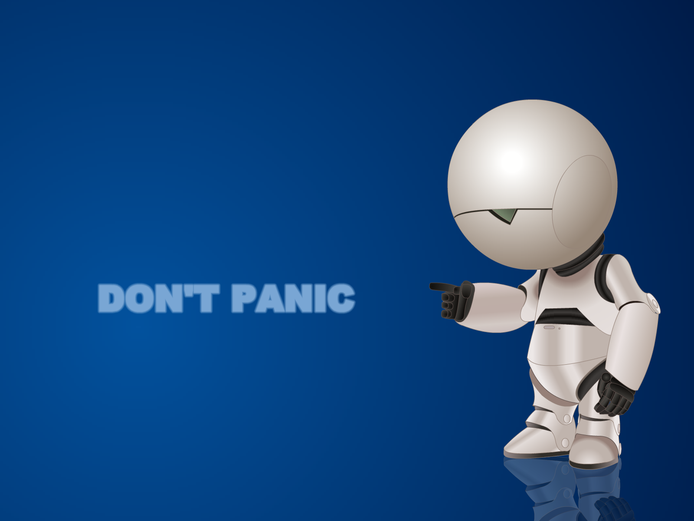

% Die P $\neq$ NP-Vermutung
% 6. Mai 2015
% Adrian Hein, Florian Weber

Einführung
==========

Turingmaschine
--------------

* mathematische Abstraktion eines Computers
* besteht aus
	* Steuerwerk
	* unendlich langes Steuerband
	* Lese- und Schreibkopf
	
Turingmaschine
--------------
	
* pro Schritt wird
	* ein Zeichen gelesen
	* ein Zeichen geschrieben
	* eine Bewegung ausgeführt
* jeder Schritt ist nur abhängig von
	* aktuellem Zeichen auf dem Band
	* aktuellem Zustand der TM
* eine TM hat endlich viele Zustände
* man kann Zustände als Endzustände definieren

Turingmaschine formal
---------------------

* formal besteht eine TM aus
	* $Q$, die endlichen Zustandsmenge
	* $\Sigma$, das endlichen Eingabealphabet
	* $\Gamma$, das endliche Bandalphabet und es gilt $\Sigma \subset \Gamma$
	* $\delta\colon (Q \setminus \{q_f\})\times \Gamma \to Q \times \Gamma \times \{L, 0, R\}$ ist die (partielle) Überführungsfunktion
	* $q_0 \in Q$ ist der Anfangszustand
	* $\square \in \Gamma\setminus\Sigma$ steht für das leere Feld
	* $q_{accept} \in Q$ ist der akzeptierende Zustand

Turingmaschine (nichtdeterministisch)
-------------------------------------

* ähnlich der deterministischen TM
* NDTM hat allerdings zwei Übergangsfunktionen $\delta_0$ und $\delta_1$
* endet eine Sequenz von Entscheidungen in $q_{accept}$ gilt die Eingabe als akzeptiert
* im Gegensatz zur deterministischen TM nicht ohne Weiteres realisierbar
	
Die Klasse P
------------

* enthält alle Entscheidungsprobleme die in Polynomialzeit von einer TM lösbar sind
* Probleme in P gelten als praktisch lösbar
* Beispiele sind:
	* Lineare Programmierung/Optimierung
	* PRIMES (AKS-Primzahltest)
	* HORNSAT
	

Die Klasse NP (formal)
----------------------

Eine Sprache $L \subseteq \{0, 1\}^*$ liegt in NP, wenn es ein Polynom $p: \mathbb{N} \rightarrow \mathbb{N}$ sowie eine in Polynomialzeit laufende TM $M$, den sogenannten Verifizierer für $L$, gibt, sodass für jedes $x \in \{0, 1\}^*$ gilt:
\
$x \in L \Leftrightarrow \exists u \in \{0, 1\}^{p(|x|)}$ sodass $M(x, u) = 1$
\
In diesem Fall nennt man $u$ ein Zertifikat für $x$.

Die Klasse NP (alternativ)
--------------------------

* alle Entscheidungsprobleme die von einer NDTM $M$ in Polynomialzeit gelöst werden
* $x$ ist eine Lösung, wenn es eine Sequenz von Entscheidungen gibt, sodass $M$ in $q_{accept}$ hält.
	* es gilt in diesem Fall $M(x) = 1$
* gibt es keine Sequenz für die $M$ in $q_{accept}$ gilt $M(x) = 0$
* ursprüngliche Definition, deswegen auch NP (nondeterministic polynomial time)
* beide Definitionen äquivalent, da die Sequenz von Entscheidungen die zu $q_{accept}$ führt als Verifizierer betrachtet werden kann

Die Klasse coNP
---------------

* alle Sprachen, deren Komplement in NP liegt
* NICHT das Komplement zu NP
* Beispiel: Kontradiktion
	

Reduktion
---------

* $A$ heißt reduzierbar auf $B$, wenn es einen Algorithmus gibt, der aus jedem Problem aus $A$ in Polynomialzeit ein Problem aus $B$ macht
* gibt es einen Algorithmus zur Lösung von $B$ und gilt $A \preceq B$, so kann dieser auch $A$ lösen
* man sagt $B$ ist mindestens so schwer wie $A$

NP-Vollständigkeit
------------------

* gilt $L \preceq L',\ \forall L \in$ NP, so nennt man $L'$ NP-schwer
* liegt $L'$ selber auch in NP nennt man $L'$ NP-vollständig
* um NP-schwere für $L'$ zu zeigen genügt es $L \preceq L'$ für ein NP-schweres $L$ zu zeigen
* ist ein Problem $A$ NP-schwer, so ist das entsprechende Problem $A'$ logischerweise coNP-schwer

<!-- 
Adrian, Quellen bisher
* http://de.wikipedia.org/wiki/P_%28Komplexit%C3%A4tsklasse%29
* http://de.wikipedia.org/wiki/Turingmaschine
* http://de.wikipedia.org/wiki/Polynomialzeit
* https://complexityzoo.uwaterloo.ca/Complexity_Zoo:P#p
* http://de.wikipedia.org/wiki/Lineare_Optimierung
* http://de.wikipedia.org/wiki/AKS-Primzahltest
* http://de.wikipedia.org/wiki/Horn-Formel
* http://de.wikipedia.org/wiki/Reduktion_%28Theoretische_Informatik%29
* http://en.wikipedia.org/wiki/Co-NP
* https://complexityzoo.uwaterloo.ca/Complexity_Zoo:C#conp
* https://homepages.uni-tuebingen.de//student/monika.gehweiler/Applets/html/resolutionIndex.html

-->

Cook-Levin Theorem {#Cook-Levin}
==================

<!-- Florian -->

Reduktion * auf SAT
-------------------

Reduktion SAT auf 3SAT
----------------------

Wichtige NP-vollständige Probleme
=================================

----

INDSET
------

<!-- Florian -->

0/1 IPROG
---------

* gegeben: $m$ lineare Ungleichungen über $n$ Variablen
* gesucht: eine Lösung für das System wobei die Variablen nur 0 oder 1 annehmen können
* in NP: die Belegung der Variablen kann als Zertifikat gesehen werden
* NP-vollständig: SAT $\preceq$ 0/1 IPROG, da jede Klausel als Ungleichung aufgefasst werden kann
	* $u_1 \vee \overline{u_2} \vee \overline{u_3}$ kann ausgedrückt werden durch $u_1 + (1 - u_2) + (1 - u_3) \geq 1$

<!-- Adrian -->

<!--
* HAMPATH
* TSP
-->

Andere Klassen
==============

<!-- Florian -->

EXP und NEXP
------------

Sonstige
--------

<!-- Zwar nicht Teil des Skripts, aber ein paar Worte über PSPACE und Co sollten auch
nicht schaden -->

Indizien
========

<!-- eher mathematischer als philosophischer Natur -->

P $\neq$ NP
-----------

<!-- Florian -->

coNP $\neq$ NP
--------------

* bisher wurde noch für kein coNP-schweres Problem ein polynomielles Zertifikat gefunden
* es konnte noch für kein NP-schweres Problem nachgewiesen werden, dass es in coNP liegt
* es konnte noch für kein Problem aus NP $\cap$ coNP NP-schwere bzw. coNP-schwere nachgewiesen werden

Resolution als Indiz für coNP $\neq$ NP
---------------------------------------

* Resolution prüft ob eine CNF eine Kontradiktion ist
* wähle 2 Klauseln $C_1, C_2$, sodass ein Literal $u$ in $C_1$ und seine Negierung $\overline{u}$ in $C_2$ vorkommen
* bild eine neue Klausel $C_3 = C_1 \backslash \{u\} \vee C_1 \backslash \{\overline{u}\}$
* $C_1 = (x \vee \overline{y} \vee z)$ und $C_2 = (y \vee z)$ werden zu $C_3 = (x \vee z)$
* es gilt $C_3 = false \Rightarrow C_1 \wedge C_2 = false$
* kann man eine leere Klausel herleiten ist die Formel eine Kontradiktion

Resolution Beispiel
---------------------------------------

<!-- evt ein ähnliches Bild selber machen -->

Resolution als Indiz für coNP $\neq$ NP
---------------------------------------

<!-- Adrian -->

Implikationen von
=================

Philosophisch
-------------

<!-- Florian -->
<!-- http://www.scottaaronson.com/blog/?p=1720 -->

Mathematische Beweise
---------------------

<!-- Adrian -->

P = NP
------

coNP = NP
---------

Probleme zwischen P und NP
--------------------------

Umgang mit NP-vollständigen Problemen
=====================================

----

Umgang mit NP-vollständigen Problemen
-------------------------------------

* Exisitieren vielleicht gute Näherungslösungen?
* Ist der Worst-Case wirklich wahrscheinlich?
* Gibt es andere Modelierungen in P?
* Ist $n$ wirklich so groß, dass NP-Vollständigkeit ein Problem darstellt?

